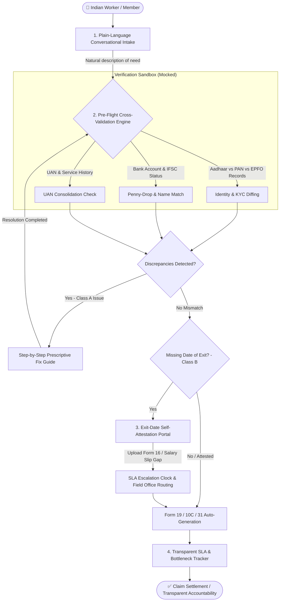
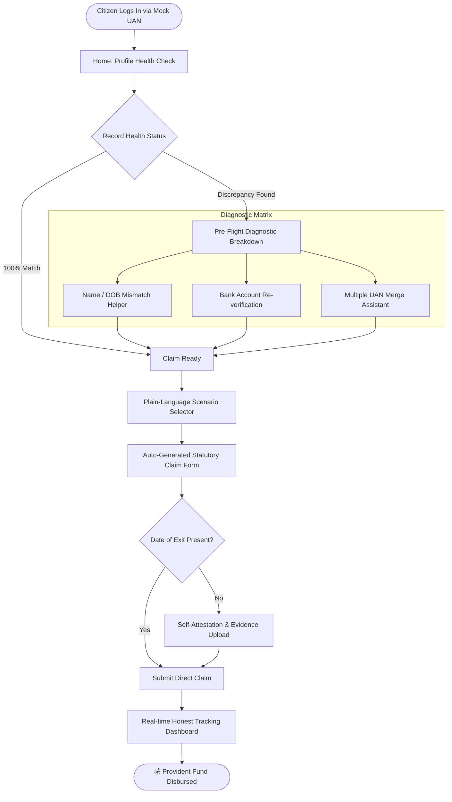

# 🏛️ Nikaasi (निकासी)
### *Designing for the 1 in 5 Provident Fund claims that get rejected.*

[](https://github.com/archittmittal/Nikaasi)
[]()
[]()
[]()

---

## 📌 Executive Summary

**Nikaasi** is an empathetic, citizen-centric Provident Fund (PF) claim and withdrawal platform built for India's workforce.

* **Target Public Institution / Portal:** **Employees' Provident Fund Organisation (EPFO)** (*Ministry of Labour & Employment, Government of India*), specifically reimagining the **Unified Member Portal (UAN)** and the **EPFiGMS Grievance Management System**.
* **The Core Thesis:** The money in a Provident Fund belongs to the worker. It is accumulated life savings, not a government grant or welfare benefit. Yet, **1 in every 5 PF withdrawal claims in India is rejected**, leaving millions in severe financial distress when they need their own money the most.

While initiatives like **EPFO 3.0** optimize the "happy path" (auto-settlements under ₹5 lakh, UPI integration, and faster processing for clean records), they do not solve the structural tail of rejections caused by clerical inconsistencies and employer non-compliance. **Nikaasi is engineered specifically for that rejected fifth.**

---

## 📊 The Scale of the Crisis

```
┌─────────────────────────────────────────┐
│              796 Lakh                   │  Total Claims Filed (2024–25)
└────────────────────┬────────────────────┘
                     │
         ┌───────────┴───────────┐
         ▼                       ▼
┌──────────────────┐   ┌──────────────────┐
│     622 Lakh     │   │     174 Lakh     │  🚨 REJECTED CLAIMS
│  Settled Claims  │   │  (21.8% of total)│  (1 in ~5 claims fail!)
└──────────────────┘   └──────────────────┘
```

* **174 Lakh Claims Rejected (2024–25):** Over 1.74 crore working citizens were denied access to their own money.
* **~26% Five-Year Average Rejection Rate:** Rejection rates have steadily climbed, with final-settlement rejections jumping from **13% (2017–18)** to **34% (2022–23)**.
* **The "Lonelier Tail" Phenomenon:** As fast-track claims settle in 3 days, the rejected minority becomes invisible—trapped behind cryptic error codes, unresponsive ex-employers, and bureaucratic loops.

---

## 🔍 Root Cause Analysis: The Two Failure Classes

Documented rejection causes are overwhelmingly **clerical and procedural**, not substantive fraud:

| Category | Primary Failure Modes | Citizen Controllability | Current System Response | Nikaasi Intervention |
| :--- | :--- | :--- | :--- | :--- |
| **Class A: Member Data Mismatches** | • Name spelling mismatch (Aadhaar vs PAN vs EPFO)<br>• Date of Birth discrepancies<br>• Unlinked / Unverified Bank IFSC<br>• Multiple fragmented UANs | **Fixable by Citizen** (if guided in correct sequence) | Opaque numeric rejection codes weeks after filing | **Pre-flight Validation Engine** catches discrepancies *before* submission and provides step-by-step resolution paths. |
| **Class B: Employer Inaction** | • Employer failed to mark **Date of Exit (DoE)**<br>• Company shut down / unresponsive HR | **NOT Fixable by Citizen** (stuck behind 3rd-party indifference) | Indefinite claim rejection or rejection loops | **Exit-Date Self-Attestation** via salary credits, Form 16, and bank statements with an active **SLA Escalation Clock**. |

---

## 💡 Key Architectural Pillars of Nikaasi



---

### 1. 🛡️ Pre-Flight Validation Engine (Prevention Over Narration)
Instead of waiting 20 days for a rejection code, Nikaasi inspects the member's profile against Aadhaar, PAN, and banking records **prior to submission**.
* Identifies transliteration differences (e.g., *Archit Mittal* vs *Architt Mittal*).
* Verifies active NPCI bank seeding and IFSC validity.
* Flags overlapping service periods or dangling UANs.

### 2. 🗣️ Plain-Language Intent Intake
Citizens shouldn't have to decipher complex regulatory forms:
* **The Member States:** *"I resigned 2 months ago and need money for my medical treatment."*
* **Nikaasi Resolves:** Automatically selects **Form 19** (Final Settlement) + **Form 10C** (Pension Withdrawal Benefit) or **Form 31** (Illness Advance / Para 68J) with proper statutory clause mapping.

### 3. ⏱️ Exit-Date Self-Attestation & Escalation Clock *(Core Innovation)*
When a former employer fails to mark the Date of Exit (DoE):
* Workers can self-attest their exit date by submitting alternative evidence (last salary credit slip, Form 16, or PF contribution cessation proof).
* Initiates a time-bound **15-Day Employer Verification SLA**.
* If the employer does not respond within the SLA window, the claim automatically routes to the **EPFO Regional Field Office Commissioner** with verified documentary evidence.

```mermaid
sequenceDiagram
    autonumber
    actor Member as 👤 Worker / Member
    participant Nikaasi as 🏛️ Nikaasi Engine
    participant Employer as 🏢 Ex-Employer HR
    participant FieldOffice as 🏛️ EPFO Regional Office

    Member->>Nikaasi: Requests PF Withdrawal (DoE Missing)
    Nikaasi-->>Member: Prompts Exit-Date Self-Attestation
    Member->>Nikaasi: Uploads Proof (Form 16 / Last Salary Slip / Bank Statement)
    Nikaasi->>Employer: Dispatches Verification Notice (Starts 15-Day SLA Clock)
    
    alt Employer Approves or Ignores SLA
        Employer-->>Nikaasi: (Option A) Confirms Exit Date
        Nikaasi->>Member: Date of Exit updated; Proceed to Disbursal
    else SLA Expires (15 Days Elapsed)
        Nikaasi->>FieldOffice: Auto-escalates with attached salary & contribution proofs
        FieldOffice->>Nikaasi: Administrative Override & Final Disbursal
        Nikaasi->>Member: Claim Approved via Statutory Escalation
    end
```

### 4. 🧭 Radically Honest & Transparent Tracking
Replaces unhelpful statuses like *"Under Process"* or *"Rejected: 104-B"* with:
* **Current Holding Stage:** Exact desk/entity holding the claim (e.g., *Waiting on Employer HR verification*).
* **Countdown SLA:** Days remaining before automatic field escalation.
* **Prescriptive Next Step:** Exactly who needs to do what, with direct phone and email escalation points.

---

## 🗺️ User Journey & Decision Matrix



---

## 🛠️ Technology Stack & Design Principles

* **Frontend:** Next.js / React, Tailwind CSS (Design System optimized for vernacular accessibility and low-bandwidth connections).
* **Validation Engine:** Rule-based heuristic validator for cross-entity KYC matching and string distance transliteration matching.
* **Audit & Escalation:** Time-stamped event log simulating legal SLAs and automated jurisdictional routing.
* **Accessibility:** High-contrast mode, Hindi/English multilingual design, and mobile-first responsive layout.

---

## ⚖️ Compliance & Ethical Sandbox Disclaimers

> [!IMPORTANT]  
> **Hackathon Prototype Notice:**  
> 1. **Independent Build:** Nikaasi is an independent prototype created for the **Build What Moves India** hackathon. It is not an official portal of the Employees' Provident Fund Organisation (EPFO) or the Government of India.
> 2. **Mock Data Only:** All Aadhaar numbers, PANs, UANs, employer details, OTPs, and bank transactions used in this prototype are **100% synthetic and mocked**. No live government API or real citizen data is ever accessed, stored, or processed.
> 3. **No Trademark Infringement:** This repository does not use official logos or trademarks of EPFO.

---

## 📅 Hackathon Milestones (Build What Moves India)

* **August 28, 2026 (8:00 PM IST):** Initial Submission (Working prototype & architecture).
* **September 1, 2026:** Shortlist of 250 announced.
* **September 7, 2026:** Mentorship & refinement iteration.
* **September 12, 2026:** Grand Finale in Bengaluru.

---

## 👥 Contributors

* **Archit Mittal** ([@archittmittal](https://github.com/archittmittal)) - *Architecture & Engineering*

---
*Built with ❤️ to move India's workforce forward.*
