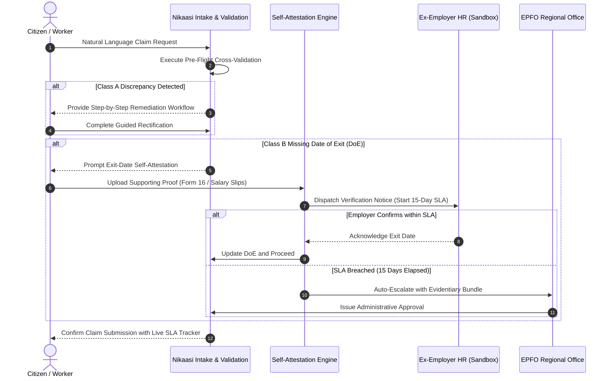

# Nikaasi (निकासी)

> Designing for the 1 in 5 Provident Fund claims that get rejected.

[](https://github.com/archittmittal/Nikaasi)
[]()
[]()
[]()
[](LICENSE)

---

## Table of Contents

- [Executive Summary](#executive-summary)
- [Problem Analysis and Industry Metrics](#problem-analysis-and-industry-metrics)
- [Root Cause Classification](#root-cause-classification)
- [Core Architectural Pillars](#core-architectural-pillars)
- [System Architecture and Workflow](#system-architecture-and-workflow)
- [Repository Structure](#repository-structure)
- [Technical Stack](#technical-stack)
- [Getting Started and Local Development](#getting-started-and-local-development)
- [Documentation Index](#documentation-index)
- [Compliance, Ethics, and Sandbox Boundaries](#compliance-ethics-and-sandbox-boundaries)
- [Project Milestones](#project-milestones)
- [Contributors](#contributors)

---

## Executive Summary

Nikaasi is an empathetic, citizen-centric Provident Fund (PF) claim and dispute resolution platform engineered for India's workforce.

- **Target Institution and Infrastructure:** Employees' Provident Fund Organisation (EPFO), Ministry of Labour and Employment, Government of India. The project specifically addresses architectural bottlenecks within the Unified Member Portal (UAN) and the EPFiGMS Grievance Management System.
- **Core Thesis:** The money residing in a Provident Fund account belongs entirely to the worker. It represents accumulated life savings withheld from monthly compensation, not a government grant, subsidy, or welfare entitlement. Despite this, **1 in every 5 PF withdrawal claims in India is rejected**, subjecting millions of working citizens to severe financial distress during critical life events.

While modern initiatives like EPFO 3.0 optimize the standard path (raising auto-settlement limits to INR 5 lakh, integrating UPI, and accelerating processing for error-free records), they do not address the structural tail of rejections driven by clerical discrepancies and employer inaction. Nikaasi is designed specifically to resolve that rejected minority.

---

## Problem Analysis and Industry Metrics

```
+-------------------------------------------------------------+
|             796 Lakh Claims Filed (2024-25)                 |
+------------------------------+------------------------------+
                               |
               +---------------+---------------+
               |                               |
               v                               v
     +-------------------+           +-------------------+
     |     622 Lakh      |           |     174 Lakh      |
     |  Settled Claims   |           |  Rejected Claims  |
     |      (78.2%)      |           | (21.8% / ~1 in 5) |
     +-------------------+           +-------------------+
```

- **174 Lakh (17.4 Million) Claims Rejected in 2024-25:** Over 1.74 crore working citizens were denied access to their accumulated savings in a single financial year.
- **26% Five-Year Average Rejection Rate:** Rejection rates have shown a multi-year upward trajectory, with final-settlement rejections rising from 13% in 2017-18 to 34% in 2022-23.
- **The "Lonelier Tail" Phenomenon:** As median processing times for clean records drop to 3 days, the rejected minority becomes increasingly invisible—isolated behind cryptic numeric error codes (e.g., "104-B"), non-responsive former employers, and opaque administrative loops.

---

## Root Cause Classification

Documented claim rejections fall into two primary structural failure modes:

| Category | Primary Failure Modes | Citizen Controllability | Legacy Portal Response | Nikaasi Intervention |
| :--- | :--- | :--- | :--- | :--- |
| **Class A: Member Data Inconsistencies** | - Transliteration discrepancies across Aadhaar, PAN, and EPFO<br>- Date of birth formatting variations<br>- Unlinked or unverified bank IFSC<br>- Fragmented, unmerged UANs | **Fixable by Citizen** (when provided with ordered, prescriptive guidance) | Delayed rejection notice with non-actionable error code weeks after submission | **Pre-Flight Validation Engine**: Cross-validates all records prior to submission and generates step-by-step remediation workflows. |
| **Class B: Employer Inaction** | - Employer failure to file **Date of Exit (DoE)**<br>- Defunct enterprise or unreachable HR department | **Not Fixable by Citizen** (stalled behind third-party indifference) | Indefinite claim freeze or repetitive rejection loops | **Exit-Date Self-Attestation Portal**: Enables worker attestation using salary credits and tax filings, backed by an enforceable **15-Day SLA Clock**. |

---

## Core Architectural Pillars

```
                     +----------------------------------+
                     | 1. Plain-Language Intent Intake  |
                     +-----------------+----------------+
                                       |
                                       v
                     +----------------------------------+
                     | 2. Pre-Flight Validation Engine  |
                     +-----------------+----------------+
                                       |
                     +-----------------+-----------------+
                     |                                   |
                     v                                   v
             [Class A Mismatch]                  [Class B Inaction]
                     |                                   |
                     v                                   v
          +---------------------+             +---------------------+
          | Prescriptive Guided |             | 3. Exit-Date Self-  |
          |  Remediation Flow   |             |     Attestation     |
          +----------+----------+             +----------+----------+
                     |                                   |
                     +-----------------+-----------------+
                                       |
                                       v
                     +----------------------------------+
                     |  4. Transparent SLA & Bottleneck |
                     |             Tracker              |
                     +----------------------------------+
```

### 1. Pre-Flight Validation Engine
Rather than subjecting citizens to a multi-week waiting cycle ending in an administrative rejection, Nikaasi inspects member records against simulated Aadhaar, PAN, and banking data prior to formal submission.
- Employs phonetic and string-distance algorithms to detect transliteration variations.
- Verifies National Payments Corporation of India (NPCI) bank seeding and active IFSC statuses.
- Surfaces overlapping service intervals and orphaned Universal Account Numbers (UANs).

### 2. Plain-Language Intent Intake
Removes statutory jargon and statutory form selection complexity from the citizen:
- Citizens describe their circumstances in conversational natural language (e.g., *"I resigned last month and need funds for medical treatment"*).
- The system automatically selects and parameterizes the statutory claim category: **Form 19** (Final PF Settlement), **Form 10C** (Pension Withdrawal Benefit), or **Form 31** (Non-Refundable Advance under specific statutory paragraphs such as Para 68J for illness).

### 3. Exit-Date Self-Attestation and SLA Escalation
Solves the Class B structural deadlock where an ex-employer neglects to record the Date of Exit (DoE):
- Enables workers to establish exit dates using corroborated documentation (last salary credit, Form 16 Part A/B, or contribution cessation gaps).
- Initiates an enforceable **15-Day Employer Verification SLA**.
- Upon SLA expiration without employer rebuttal, the claim automatically routes to the **EPFO Regional Field Office (RPFC)** with a verified evidentiary bundle for statutory administrative override.

### 4. Transparent SLA and Bottleneck Tracker
Replaces vague status notices (such as *"Under Process"*) with complete visibility:
- **Holding Entity:** Identifies the precise institutional desk currently processing the record (e.g., *Employer HR Verification Desk* or *Regional Field Office Assistant Commissioner*).
- **Enforceable Countdown:** Displays remaining days before automatic escalation triggers.
- **Prescriptive Next Steps:** Identifies clear remedial actions and official escalation points.

---

## System Architecture and Workflow



---

## Repository Structure

```
.
|-- docs/
|   |-- ARCHITECTURE.md              # System architecture, subsystems, and data flows
|   |-- PRD.md                       # Product requirements, personas, and regulatory mapping
|   |-- TECHNICAL_SPECIFICATION.md   # Algorithmic models, heuristics, and schemas
|   |-- API_REFERENCE.md             # REST interface specifications and payloads
|   |-- SECURITY_AND_COMPLIANCE.md   # Privacy standards, DPDP Act 2023, and threat model
|   |-- DEPLOYMENT_AND_OPERATIONS.md # Deployment runbook, containerization, and monitoring
|   `-- CONTRIBUTING.md              # Engineering standards and contribution guidelines
|-- nikaasi-problem-statement.pdf   # Hackathon specification brief
|-- .gitignore                       # Standard version control exclusions
`-- README.md                        # Project root documentation
```

---

## Technical Stack

- **Frontend Application:** Next.js (App Router), React, TypeScript, Tailwind CSS.
- **Validation Engine:** Algorithmic heuristics for phonetic matching (Soundex / Metaphone) and string distance metrics (Jaro-Winkler, Levenshtein).
- **State Machine and Escalation:** Deterministic event-driven SLA state engine with configurable time-travel triggers for evaluation.
- **Accessibility Framework:** WCAG 2.1 AA compliance, high-contrast support, responsive layout, and bilingual capability (Hindi / English).

---

## Getting Started and Local Development

### Prerequisites

- **Node.js:** v18.x, v20.x, or v24.x LTS
- **Package Manager:** npm (v9.x or later) or pnpm
- **Git:** v2.30+

### Installation

```bash
# Clone the repository
git clone https://github.com/archittmittal/Nikaasi.git
cd Nikaasi

# Install project dependencies
npm install

# Run the local development server
npm run dev
```

The application will be accessible at `http://localhost:3000`.

---

## Documentation Index

Comprehensive production documentation is available within the `docs/` directory:

1. [System Architecture Document](docs/ARCHITECTURE.md) - Deep dive into subsystems, C4 component models, and data synchronization.
2. [Product Requirements Document (PRD)](docs/PRD.md) - Functional specifications, user personas, and regulatory alignments.
3. [Technical Specification](docs/TECHNICAL_SPECIFICATION.md) - Algorithmic models for identity diffing, SLA state machines, and data schemas.
4. [API Reference](docs/API_REFERENCE.md) - Complete endpoints, parameters, request/response models, and error codes.
5. [Security and Compliance Guide](docs/SECURITY_AND_COMPLIANCE.md) - DPDP Act 2023 compliance, PII redaction, and STRIDE threat analysis.
6. [Deployment and Operations Runbook](docs/DEPLOYMENT_AND_OPERATIONS.md) - Infrastructure specifications, container orchestration, and CI/CD.
7. [Contribution Guidelines](docs/CONTRIBUTING.md) - Git workflows, code standards, and testing protocols.

---

## Compliance, Ethics, and Sandbox Boundaries

1. **Independent Prototype Notice:** Nikaasi is an independent technical prototype developed for the *Build What Moves India* hackathon. It is not an official portal of the Employees' Provident Fund Organisation (EPFO) or the Government of India.
2. **Synthetic Data Sandbox:** All Aadhaar numbers, Permanent Account Numbers (PANs), Universal Account Numbers (UANs), employer profiles, bank identifiers, and OTP verifications used within this project are **100% synthetic and mocked**. No live government API or real citizen data is ever accessed, stored, or processed.
3. **Trademark and Identity Protection:** This repository contains no official logos, emblems, or trademarks of the EPFO or the Ministry of Labour and Employment.

---

## Project Milestones

- **August 28, 2026 (8:00 PM IST):** Initial Submission (Working prototype and production documentation).
- **September 1, 2026:** Announcement of Shortlisted Projects.
- **September 7, 2026:** Mentorship and Refinement Iteration.
- **September 12, 2026:** Grand Finale in Bengaluru.

---

## Contributors

- **Archit Mittal** ([@archittmittal](https://github.com/archittmittal)) - *Architecture and Engineering*
- **Purvansh Joshi** ([@purvanshjoshi](https://github.com/purvanshjoshi)) - *Core Engineering and Production Systems*
