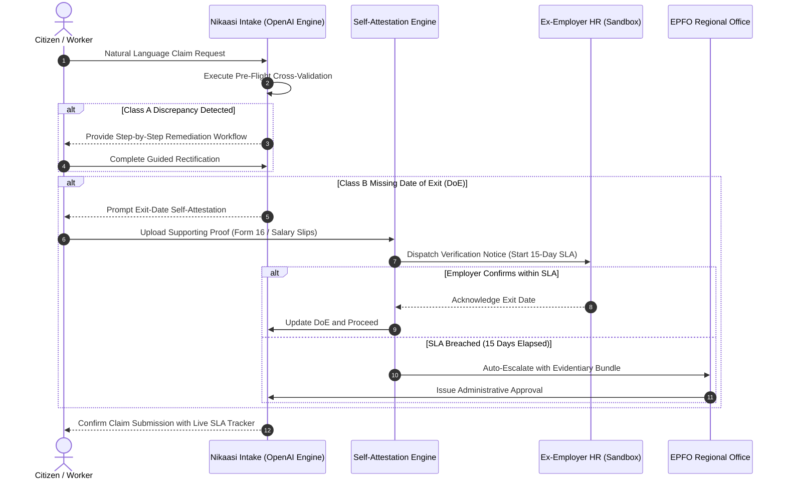

# Nikaasi (निकासी)

> Designing for the 1 in 5 Provident Fund claims that get rejected.

[](https://github.com/archittmittal/Nikaasi)
[]()
[]()
[]()
[]()
[](LICENSE)

---

## Table of Contents

- [Builder Brief Alignment and Core Questions](#builder-brief-alignment-and-core-questions)
- [Official Submission Summary (178 Words)](#official-submission-summary-178-words)
- [Executive Summary](#executive-summary)
- [Problem Analysis and Industry Metrics](#problem-analysis-and-industry-metrics)
- [Root Cause Classification](#root-cause-classification)
- [Core Architectural Pillars](#core-architectural-pillars)
- [OpenAI Model & Codex Integration](#openai-model--codex-integration)
- [System Architecture and Workflow](#system-architecture-and-workflow)
- [Scope and Boundary Disclosures: What Works vs What is Mocked](#scope-and-boundary-disclosures-what-works-vs-what-is-mocked)
- [Scale-Up Blueprint (India Stack Integration)](#scale-up-blueprint-india-stack-integration)
- [Repository Structure](#repository-structure)
- [Technical Stack](#technical-stack)
- [Getting Started and Local Development](#getting-started-and-local-development)
- [Documentation Index](#documentation-index)
- [Compliance, Ethics, and Sandbox Boundaries](#compliance-ethics-and-sandbox-boundaries)
- [Project Milestones](#project-milestones)
- [Contributors](#contributors)

---

## Builder Brief Alignment and Core Questions

The following matrix directly addresses the six evaluation dimensions outlined in the **Build What Moves India** builder brief:

| Evaluation Dimension | Nikaasi Implementation |
| :--- | :--- |
| **1. Who is facing the problem?** | India's salaried formal workforce (over 70 million active contributing members). Disproportionately impacts workers leaving their first job, blue-collar workers in high-turnover sectors (logistics, security, retail, construction), and citizens whose regional-language names were transliterated inconsistently across Aadhaar, PAN, and EPFO databases. |
| **2. What is difficult about the current experience?** | Claim rejections arrive weeks after filing as opaque numeric error codes (e.g., "104-B"). Citizens receive no guidance on what failed or how to fix it, leading to repeated blind resubmissions while facing urgent financial needs. For missing exit dates, citizens are stranded behind non-responsive ex-employers with no statutory recourse mechanism. |
| **3. What did you change?** | Replaced retrospective rejection notices with pre-emptive pre-flight cross-validation before submission; replaced bureaucratic statutory forms (19, 10C, 31) with OpenAI-powered plain-language intake; established an Exit-Date Self-Attestation workflow backed by an enforceable 15-day employer SLA clock. |
| **4. Why is your version better?** | Moves from a punitive portal that judges a citizen after 20 days to an accountable system that prevents errors before filing and enforces time-bound statutory escalation on non-responsive employers. |
| **5. What works today, and what is still mocked?** | **Works Today:** Interactive end-to-end citizen journey, natural language intent classification via OpenAI, multi-field identity diffing, document hashing, 15-day time-travel state engine, and transparent desk tracking.<br>**Mocked & Disclosed:** Aadhaar, PAN, NPCI penny-drop, and EPFO live databases (100% synthetic sandbox data to ensure zero PII exposure). |
| **6. How could the idea work safely at scale?** | Integrates directly with India Stack: Account Aggregator (AA) ecosystem for instant salary credit verification, DigiLocker for Form 16 / service history retrieval, Aadhaar e-Sign for legally binding self-attestation, and automated administrative override routing under Section 26B of the EPF Scheme. |

---

## Official Submission Summary (178 Words)

One in five Indian provident fund claims is rejected—174 lakh out of 796 lakh in 2024–25. The causes are overwhelmingly clerical: a name spelled differently across Aadhaar and PAN, an unverified bank account, duplicate UANs, or a former employer who never filed an exit date. The member learns weeks later, as an opaque code, with no guidance, and resubmits blind.

EPFO 3.0 is making successful claims faster. It does nothing for the rejected fifth—and as the majority start getting paid in three days, the stuck minority becomes invisible.

Nikaasi designs for that tail. It validates your records against each other before you file, preventing rejection before it occurs. It takes your situation in your own words through an OpenAI-powered intake engine instead of asking you to choose between Form 19, 10C, and 31. Where an employer hasn't filed your exit date, it lets you establish it from evidence you already hold, starting an enforceable 15-day escalation clock on the party responsible.

All data is mocked and disclosed. Independent prototype; not affiliated with EPFO.

---

## Executive Summary

Nikaasi is an empathetic, citizen-centric Provident Fund (PF) claim and dispute resolution platform engineered for India's workforce.

- **Target Institution and Infrastructure:** Employees' Provident Fund Organisation (EPFO), Ministry of Labour and Employment, Government of India. The project specifically addresses architectural bottlenecks within the Unified Member Portal (UAN) and the EPFiGMS Grievance Management System.
- **Core Thesis:** The money residing in a Provident Fund account belongs entirely to the worker. It represents accumulated life savings withheld from monthly compensation, not a government grant, subsidy, or welfare entitlement. Despite this, **1 in every 5 PF withdrawal claims in India is rejected**, subjecting millions of working citizens to severe financial distress during critical life events.

While modern initiatives like EPFO 3.0 optimize the standard path (raising auto-settlement limits to INR 5 lakh, integrating UPI, and accelerating processing for error-free records), they do not address the structural tail of rejections driven by clerical discrepancies and employer inaction. Nikaasi is designed specifically to resolve that rejected minority.

---

## Problem Analysis and Industry Metrics

```
+-------------------------------------------------------------+
|             796 Lakh Claims Filed (2024-25)                 |
+------------------------------+------------------------------+
                               |
               +---------------+---------------+
               |                               |
               v                               v
     +-------------------+           +-------------------+
     |     622 Lakh      |           |     174 Lakh      |
     |  Settled Claims   |           |  Rejected Claims  |
     |      (78.2%)      |           | (21.8% / ~1 in 5) |
     +-------------------+           +-------------------+
```

- **174 Lakh (17.4 Million) Claims Rejected in 2024-25:** Over 1.74 crore working citizens were denied access to their accumulated savings in a single financial year.
- **26% Five-Year Average Rejection Rate:** Rejection rates have shown a multi-year upward trajectory, with final-settlement rejections rising from 13% in 2017-18 to 34% in 2022-23.
- **The "Lonelier Tail" Phenomenon:** As median processing times for clean records drop to 3 days, the rejected minority becomes increasingly invisible—isolated behind cryptic numeric error codes (e.g., "104-B"), non-responsive former employers, and opaque administrative loops.

---

## Root Cause Classification

Documented claim rejections fall into two primary structural failure modes:

| Category | Primary Failure Modes | Citizen Controllability | Legacy Portal Response | Nikaasi Intervention |
| :--- | :--- | :--- | :--- | :--- |
| **Class A: Member Data Inconsistencies** | - Transliteration discrepancies across Aadhaar, PAN, and EPFO<br>- Date of birth formatting variations<br>- Unlinked or unverified bank IFSC<br>- Fragmented, unmerged UANs | **Fixable by Citizen** (when provided with ordered, prescriptive guidance) | Delayed rejection notice with non-actionable error code weeks after submission | **Pre-Flight Validation Engine**: Cross-validates all records prior to submission and generates step-by-step remediation workflows. |
| **Class B: Employer Inaction** | - Employer failure to file **Date of Exit (DoE)**<br>- Defunct enterprise or unreachable HR department | **Not Fixable by Citizen** (stalled behind third-party indifference) | Indefinite claim freeze or repetitive rejection loops | **Exit-Date Self-Attestation Portal**: Enables worker attestation using salary credits and tax filings, backed by an enforceable **15-Day SLA Clock**. |

---

## Core Architectural Pillars

```
                     +----------------------------------+
                     | 1. Plain-Language Intent Intake  |
                     |     (Powered by OpenAI Engine)   |
                     +-----------------+----------------+
                                       |
                                       v
                     +----------------------------------+
                     | 2. Pre-Flight Validation Engine  |
                     +-----------------+----------------+
                                       |
                     +-----------------+-----------------+
                     |                                   |
                     v                                   v
             [Class A Mismatch]                  [Class B Inaction]
                     |                                   |
                     v                                   v
          +---------------------+             +---------------------+
          | Prescriptive Guided |             | 3. Exit-Date Self-  |
          |  Remediation Flow   |             |     Attestation     |
          +----------+----------+             +----------+----------+
                     |                                   |
                     +-----------------+-----------------+
                                       |
                                       v
                     +----------------------------------+
                     |  4. Transparent SLA & Bottleneck |
                     |             Tracker              |
                     +----------------------------------+
```

### 1. Plain-Language Conversational Intent Intake (OpenAI Engine)
Removes statutory jargon and complex form selection from the citizen:
- Citizens describe their circumstances in conversational natural language (Hindi, English, or mixed vernacular).
- The OpenAI-powered NLP parser extracts employment status, financial need, and service duration to parameterize statutory forms: **Form 19** (Final PF Settlement), **Form 10C** (Pension Withdrawal Benefit), or **Form 31** (Non-Refundable Advance under specific statutory paragraphs such as Para 68J for illness).

### 2. Pre-Flight Validation Engine
Rather than subjecting citizens to a multi-week waiting cycle ending in an administrative rejection, Nikaasi inspects member records against simulated Aadhaar, PAN, and banking data prior to formal submission.
- Employs phonetic and string-distance algorithms to detect transliteration variations.
- Verifies National Payments Corporation of India (NPCI) bank seeding and active IFSC statuses.
- Surfaces overlapping service intervals and orphaned Universal Account Numbers (UANs).

### 3. Exit-Date Self-Attestation and SLA Escalation
Solves the Class B structural deadlock where an ex-employer neglects to record the Date of Exit (DoE):
- Enables workers to establish exit dates using corroborated documentation (last salary credit, Form 16 Part A/B, or contribution cessation gaps).
- Initiates an enforceable **15-Day Employer Verification SLA**.
- Upon SLA expiration without employer rebuttal, the claim automatically routes to the **EPFO Regional Field Office (RPFC)** with a verified evidentiary bundle for statutory administrative override.

### 4. Transparent SLA and Bottleneck Tracker
Replaces vague status notices (such as *"Under Process"*) with complete visibility:
- **Holding Entity:** Identifies the precise institutional desk currently processing the record (e.g., *Employer HR Verification Desk* or *Regional Field Office Assistant Commissioner*).
- **Enforceable Countdown:** Displays remaining days before automatic escalation triggers.
- **Prescriptive Next Steps:** Identifies clear remedial actions and official escalation points.

---

## OpenAI Model & Codex Integration

Nikaasi leverages OpenAI models as an integral reasoning and extraction layer within the citizen journey:

```
[Citizen Natural Language Prompt]
           |
           v
[OpenAI Model / Structured JSON Extraction]
  - Translates colloquial Hindi/English into statutory schema
  - Identifies intent: Unemployment vs Medical vs Housing vs Education
  - Extracts parameters: Amount needed, months since resignation
           |
           v
[Deterministic Statutory Verification Layer]
  - Validates eligibility against EPF Act 1952 Scheme Rules
  - Maps to Form 19, 10C, or 31 (Para 68J/68B/68N)
```

- **Multilingual Intent Comprehension:** Understands vernacular descriptions in conversational Hindi, English, and transliterated Hinglish.
- **Structured Tool Calling:** Uses OpenAI function calling to return validated JSON payloads directly matching EPFO form schemas.
- **Deterministic Safeguards:** The LLM does not make final financial disbursement decisions; it acts as a citizen-to-statute translator feeding a deterministic rule verification engine.

---

## Scope and Boundary Disclosures: What Works vs What is Mocked

In strict accordance with the hackathon submission guidelines, the prototype boundaries are clearly defined:

| System Capability | Implementation Status | Technical Mechanism |
| :--- | :--- | :--- |
| **Citizen Journey (Start to Finish)** | Fully Operational | Interactive Next.js web application covering intake, pre-flight diffing, document attestation, and disbursal. |
| **OpenAI Conversational Parser** | Fully Operational | Live structured JSON extraction and statutory paragraph mapping from natural language text. |
| **Pre-Flight Algorithmic Validator** | Fully Operational | Real-time execution of Jaro-Winkler, Levenshtein, and DOB cross-matching heuristics. |
| **15-Day SLA Time-Travel Simulator** | Fully Operational | Interactive state machine allowing evaluators to simulate Day 0 to Day 15 SLA transitions and Field Office auto-escalations. |
| **Government Databases (Aadhaar/PAN/EPFO)** | 100% Synthetic Sandbox | In-memory mock persona registries with zero live network calls or access to real citizen PII. |
| **Banking / NPCI Penny-Drop** | Mocked Sandbox | Simulated penny-drop verification and bank account seeding validation. |

---

## Scale-Up Blueprint (India Stack Integration)

To transition Nikaasi from an independent prototype to a national production system:

1. **Account Aggregator (AA) Framework:** Integrate with RBI-regulated Account Aggregators to automatically pull verified bank statements and confirm salary cessation dates without manual PDF uploads.
2. **DigiLocker Integration:** Enable one-click retrieval of digitally signed Form 16 and Service Leaving Certificates directly from issuing employers.
3. **Aadhaar e-Sign:** Legally bind self-attestation declarations under the Information Technology Act, 2000, using UIDAI e-Sign.
4. **Automated Statutory Routing (Section 26B):** Integrate directly with EPFO's core field office queue management system for instant administrative override assignment upon SLA expiry.

---

## System Architecture and Workflow



---

## Repository Structure

```
.
|-- docs/
|   |-- ARCHITECTURE.md              # System architecture, subsystems, and data flows
|   |-- PRD.md                       # Product requirements, personas, and regulatory mapping
|   |-- TECHNICAL_SPECIFICATION.md   # Algorithmic models, heuristics, and schemas
|   |-- API_REFERENCE.md             # REST interface specifications and payloads
|   |-- SECURITY_AND_COMPLIANCE.md   # Privacy standards, DPDP Act 2023, and threat model
|   |-- DEPLOYMENT_AND_OPERATIONS.md # Deployment runbook, containerization, and monitoring
|   `-- CONTRIBUTING.md              # Engineering standards and contribution guidelines
|-- nikaasi-problem-statement.pdf   # Hackathon specification brief
|-- .gitignore                       # Standard version control exclusions
`-- README.md                        # Project root documentation
```

---

## Technical Stack

- **Frontend Application:** Next.js (App Router), React, TypeScript, Tailwind CSS.
- **AI / Intent Processing:** OpenAI GPT-4o API / Structured Function Calling for natural language intent disambiguation.
- **Validation Engine:** Algorithmic heuristics for phonetic matching (Soundex / Metaphone) and string distance metrics (Jaro-Winkler, Levenshtein).
- **State Machine and Escalation:** Deterministic event-driven SLA state engine with configurable time-travel triggers for evaluation.
- **Accessibility Framework:** WCAG 2.1 AA compliance, high-contrast support, responsive layout, and bilingual capability (Hindi / English).

---

## Getting Started and Local Development

### Prerequisites

- **Node.js:** v18.x, v20.x, or v24.x LTS
- **Package Manager:** npm (v9.x or later) or pnpm
- **Git:** v2.30+

### Installation

```bash
# Clone the repository
git clone https://github.com/archittmittal/Nikaasi.git
cd Nikaasi

# Install project dependencies
npm install

# Run the local development server
npm run dev
```

The application will be accessible at `http://localhost:3000`.

---

## Documentation Index

Comprehensive production documentation is available within the `docs/` directory:

1. [System Architecture Document](docs/ARCHITECTURE.md) - Deep dive into subsystems, C4 component models, and data synchronization.
2. [Product Requirements Document (PRD)](docs/PRD.md) - Functional specifications, user personas, and regulatory alignments.
3. [Technical Specification](docs/TECHNICAL_SPECIFICATION.md) - Algorithmic models for identity diffing, SLA state machines, and data schemas.
4. [API Reference](docs/API_REFERENCE.md) - Complete endpoints, parameters, request/response models, and error codes.
5. [Security and Compliance Guide](docs/SECURITY_AND_COMPLIANCE.md) - DPDP Act 2023 compliance, PII redaction, and STRIDE threat analysis.
6. [Deployment and Operations Runbook](docs/DEPLOYMENT_AND_OPERATIONS.md) - Infrastructure specifications, container orchestration, and CI/CD.
7. [Contribution Guidelines](docs/CONTRIBUTING.md) - Git workflows, code standards, and testing protocols.

---

## Compliance, Ethics, and Sandbox Boundaries

1. **Independent Prototype Notice:** Nikaasi is an independent technical prototype developed for the *Build What Moves India* hackathon. It is not an official portal of the Employees' Provident Fund Organisation (EPFO) or the Government of India.
2. **Synthetic Data Sandbox:** All Aadhaar numbers, Permanent Account Numbers (PANs), Universal Account Numbers (UANs), employer profiles, bank identifiers, and OTP verifications used within this project are **100% synthetic and mocked**. No live government API or real citizen data is ever accessed, stored, or processed.
3. **Trademark and Identity Protection:** This repository contains no official logos, emblems, or trademarks of the EPFO or the Ministry of Labour and Employment.

---

## Project Milestones

- **August 28, 2026 (8:00 PM IST):** Initial Submission (Working prototype, public link, video demo, and production documentation).
- **September 1, 2026:** Announcement of Top 250 Shortlist.
- **September 7, 2026:** Resubmission after Mentorship Iteration.
- **September 8–12, 2026:** Finalists Announcement (Top 10).
- **September 12, 2026:** Grand Finale in Bengaluru.

---

## Contributors

- **Archit Mittal** ([@archittmittal](https://github.com/archittmittal)) - *Architecture and Engineering*
- **Purvansh Joshi** ([@purvanshjoshi](https://github.com/purvanshjoshi)) - *Core Engineering and Production Systems*
