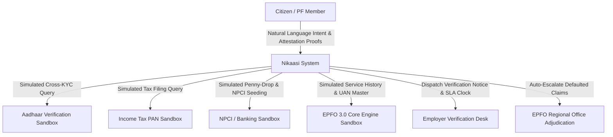
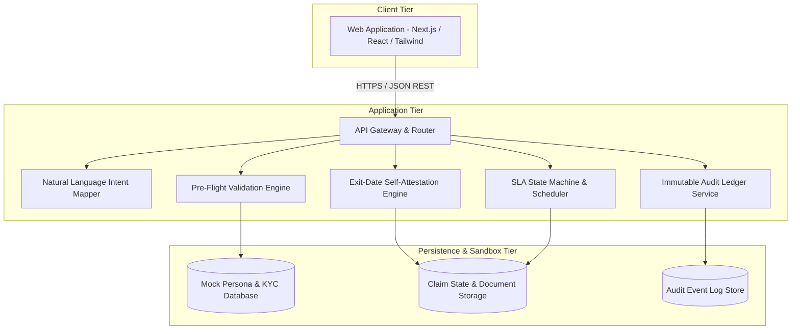

# Nikaasi System Architecture Document

## Document Metadata

- **Document Version:** 1.0.0
- **Status:** Approved Architecture
- **Target Audience:** System Architects, Core Engineers, Technical Evaluators, Security Auditors
- **Classification:** Public Digital Infrastructure Specification (Independent Prototype)

---

## 1. Architectural Vision and Principles

Nikaasi is designed as a resilience layer on top of India's social security digital public infrastructure. The platform shifts the paradigm from a punitive administrative portal that passively judges a citizen's application to an active, preventative, and accountable citizen advocate.

### Core Design Principles

1. **Prevention Over Narration:** Prevent rejections at intake by cross-referencing records against simulated authoritative data stores before form submission.
2. **Intent-Driven Interaction:** Abstract statutory codes (e.g., Para 68J, Form 19, Form 10C) behind conversational, plain-language scenario builders.
3. **Equitable Escalation (Statutory Recourse):** Guarantee that uncooperative or defunct third parties (employers) cannot indefinitely stall citizen access to their accumulated savings.
4. **Radical Transparency:** Expose exact processing bottlenecks, desk assignments, and deterministic countdown timers for every lifecycle event.
5. **Universal Accessibility:** Build for low-bandwidth networks, vernacular language users (Hindi and English), and WCAG 2.1 AA accessibility standards.

---

## 2. High-Level Architecture (C4 Model)

### 2.1 System Context (Level 1)



### 2.2 Container Diagram (Level 2)



---

## 3. Core Subsystems

### 3.1 Intake and Intent Disambiguation Subsystem

The Intake Subsystem accepts unformatted natural language text from the citizen and maps it to statutory claim types without exposing regulatory jargon.

```
+-------------------------------------------------------+
| Citizen Input: "I resigned 2 months ago and need      |
| funds for hospital surgery."                          |
+---------------------------+---------------------------+
                            |
                            v
+-------------------------------------------------------+
| Rule-Based Intent Classifier / Lexical Parser         |
| - Employment Status: RESIGNED (> 60 days)             |
| - Primary Need: MEDICAL TREATMENT                     |
| - Service Duration: Evaluated against 5-year threshold|
+---------------------------+---------------------------+
                            |
                            v
+-------------------------------------------------------+
| Statutory Claim Mapping:                              |
| - Form 19: Full & Final Settlement (PF)               |
| - Form 10C: Pension Withdrawal Benefit                |
| - Form 31: Para 68J (Illness Advance)                 |
+-------------------------------------------------------+
```

### 3.2 Pre-Flight Cross-Validation Subsystem

The Pre-Flight Engine executes automated diffing across three identity and financial planes prior to generating a submission payload:

1. **Identity Plane (Aadhaar vs. PAN vs. EPFO UAN Master):**
   - Transliteration tolerance matching (Jaro-Winkler distance threshold >= 0.88).
   - Date of Birth normalization and chronological validation.
   - Father's/Spouse's name phonetic alignment.
2. **Financial Plane (NPCI Seeding vs. Bank Account Master):**
   - Active IFSC format and operational status check.
   - Name-at-bank versus name-at-EPFO comparison.
   - Account number checksum validation.
3. **Employment Plane (UAN Master & Service Records):**
   - Multiple active UAN detection.
   - Overlapping service period detection.
   - Date of Exit (DoE) presence verification.

### 3.3 Exit-Date Self-Attestation Subsystem

When the Pre-Flight Engine identifies a missing Date of Exit (DoE), the Self-Attestation Subsystem engages:

```mermaid
sequenceDiagram
    autonumber
    actor Member as Citizen
    participant Portal as Attestation Interface
    participant Engine as SLA State Machine
    participant Employer as Employer Portal
    participant FieldOffice as Regional Office

    Member->>Portal: Declare Exit Date & Upload Evidence (Form 16 / Salary Slips)
    Portal->>Engine: Generate Attestation Bundle with SHA-256 Hashes
    Engine->>Employer: Transmit Formal Verification Notice (Trigger 15-Day SLA)
    
    alt Employer Acts within SLA Window
        Employer->>Engine: Acknowledge & Confirm Exit Date
        Engine->>Portal: Update DoE to Confirmed Status; Proceed to Settlement
    else Employer Contests
        Employer->>Engine: Submit Dispute with Reason Code
        Engine->>FieldOffice: Route to RPFC for Dispute Adjudication
    else SLA Expires (Day 15 Elapsed without Action)
        Engine->>Engine: Transition State to SLA_BREACHED_AUTO_ESCALATED
        Engine->>FieldOffice: Transmit Dossier to Assistant Commissioner Desk
        FieldOffice->>Engine: Execute Statutory Administrative Override
        Engine->>Portal: Claim Cleared via Administrative Override
    end
```

### 3.4 Radical Transparency and Audit Subsystem

Every claim transition produces an immutable audit record:

```json
{
  "eventId": "evt_88392019482",
  "claimId": "clm_del_2026_09182",
  "timestamp": "2026-08-27T08:15:30.000Z",
  "holdingDesk": "EMPLOYER_HR_DESK",
  "assignedEntity": "Apex Technologies India Pvt Ltd (HR Operations)",
  "state": "PENDING_EMPLOYER_VERIFICATION",
  "slaDeadline": "2026-09-11T08:15:30.000Z",
  "daysRemaining": 15,
  "nextAutomatedAction": "ESCALATE_TO_REGIONAL_OFFICE_DELHI_EAST",
  "actionableRemedy": "Contact Employer HR at hr-nodal@apextech.mock or wait for automated escalation."
}
```

---

## 4. State Machine Definition

The claim lifecycle is governed by a deterministic finite state machine (FSM):

```
+----------------+
|     DRAFT      |
+-------+--------+
        |
        v
+----------------+       [Class A Errors]       +--------------------+
| PREFLIGHT_INIT | ---------------------------> | REMEDIATION_GUIDE  |
+-------+--------+                              +---------+----------+
        |                                                 |
        | [Clean]                                         | [Resolved]
        v                                                 |
+----------------+                                        |
| READY_TO_FILE  | <--------------------------------------+
+-------+--------+
        |
        +-----------------------------------+
        | [DoE Present]                     | [DoE Missing]
        v                                   v
+----------------+                  +--------------------+
| FILED_DIRECT   |                  | ATTESTATION_PENDING|
+-------+--------+                  +---------+----------+
        |                                     | [Evidence Uploaded]
        |                                     v
        |                           +--------------------+
        |                           | SLA_ACTIVE_EMPLOYER| (15-Day Clock)
        |                           +----+-------------+-+
        |                                |             |
        |               [Employer OK]    |             | [Day 15 Breach]
        |            +-------------------+             +------------------+
        |            |                                                    |
        v            v                                                    v
+------------------------+                              +--------------------+
| PROCESSING_EPFO_SETTLE |                              | FIELD_OFFICE_QUEUE |
+-----------+------------+                              +---------+----------+
            |                                                     | [Commissioner Sign-off]
            |                                                     |
            +---------------------------+-------------------------+
                                        |
                                        v
                            +------------------------+
                            |   SETTLED_DISBURSED    |
                            +------------------------+
```

---

## 5. Resilience, Security, and Scalability

1. **Stateless Compute Layer:** The application services run as stateless workers capable of horizontal autoscaling under peak tax-season claim surges.
2. **Idempotency Safeguards:** Every claim submission carries an idempotency token (`Idempotency-Key`) preventing duplicate statutory claim creation.
3. **Data Boundary Isolation:** The sandbox environment strictly enforces isolation from external networks and live government interfaces, guaranteeing complete privacy and zero data leakage.
4. **Client-Side Compute Optimization:** Form cross-validation and fuzzy string diffing are executed locally in the browser to reduce server round-trips and provide instant feedback.
