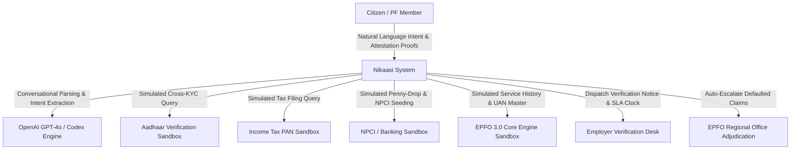
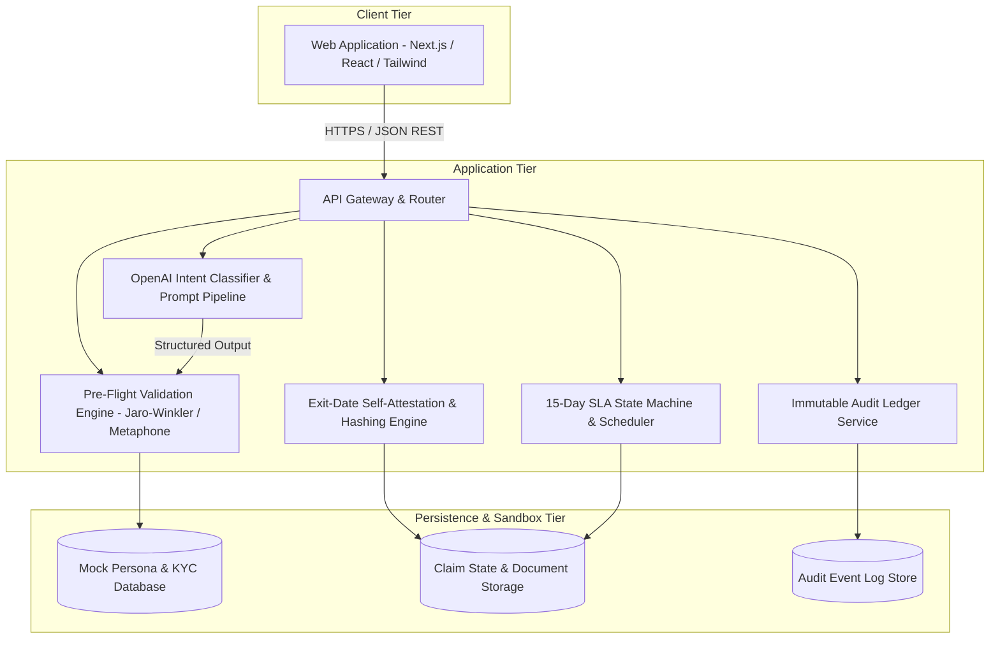

# Nikaasi System Architecture Document

## Document Metadata

- **Document Version:** 1.1.0
- **Status:** Approved Architecture
- **Target Audience:** System Architects, Core Engineers, Technical Evaluators, Security Auditors
- **Classification:** Public Digital Infrastructure Specification (Independent Prototype)
- **AI Reasoning Subsystem:** OpenAI GPT-4o / Codex Structured Parsing Engine

---

## 1. Architectural Vision and Principles

Nikaasi is designed as a citizen-advocate resilience layer on top of India's social security digital public infrastructure. The platform shifts the paradigm from a punitive administrative portal that passively rejects citizen applications to an active, preventative, and accountable system.

### Core Design Principles

1. **Prevention Over Narration:** Prevent claim rejections prior to formal filing by executing cross-database pre-flight checks against simulated authoritative sources.
2. **Intent-Driven Natural Language Intake:** Leverage OpenAI models to abstract statutory codes (Forms 19, 10C, 31, Para 68J/68B) behind natural vernacular conversations in Hindi and English.
3. **Equitable Escalation (Statutory Recourse):** Guarantee that uncooperative third parties (ex-employers) cannot indefinitely lock citizen savings through an automated 15-day SLA escalation clock.
4. **Radical Transparency:** Expose exact holding desks, responsible officers, and deterministic countdown timers for every lifecycle event.
5. **Universal Accessibility:** Build for low-bandwidth mobile devices, vernacular language comprehension, and WCAG 2.1 AA accessibility standards.

---

## 2. High-Level Architecture (C4 Model)

### 2.1 System Context (Level 1)



### 2.2 Container Diagram (Level 2)



---

## 3. Core Subsystems

### 3.1 OpenAI-Powered Conversational Intake Subsystem

The Intake Subsystem translates unformatted natural language into validated statutory claim parameters using OpenAI GPT-4o with structured tool calling:

```
+-------------------------------------------------------+
| Citizen Input (Hindi/English/Hinglish):               |
| "Maine 2 mahine pehle job chhod di thi, mujhe PF      |
| aur pension ka poora paisa nikalna hai."              |
+---------------------------+---------------------------+
                            |
                            v
+-------------------------------------------------------+
| OpenAI Semantic Parsing Layer                         |
| - employment_status: "RESIGNED"                       |
| - months_unemployed: 2                                |
| - intent_category: "FULL_FINAL_SETTLEMENT"            |
| - requested_amount: null (Full Balance)               |
+---------------------------+---------------------------+
                            |
                            v
+-------------------------------------------------------+
| Deterministic Statutory Mapping:                      |
| - Primary Form: FORM_19 (Final PF Settlement)         |
| - Secondary Form: FORM_10C (Pension Benefit)          |
| - Statutory Paragraph: None (Full Withdrawal)         |
+-------------------------------------------------------+
```

### 3.2 Pre-Flight Cross-Validation Subsystem

The Pre-Flight Engine executes automated diffing across three identity and financial planes prior to generating a submission payload:

1. **Identity Plane (Aadhaar vs. PAN vs. EPFO UAN Master):**
   - Transliteration tolerance matching (Jaro-Winkler distance threshold >= 0.88).
   - Date of Birth normalization and chronological validation.
   - Father's/Spouse's name phonetic alignment.
2. **Financial Plane (NPCI Seeding vs. Bank Account Master):**
   - Active IFSC format and operational status check.
   - Name-at-bank versus name-at-EPFO comparison.
   - Account number checksum validation.
3. **Employment Plane (UAN Master & Service Records):**
   - Multiple active UAN detection.
   - Overlapping service period detection.
   - Date of Exit (DoE) presence verification.

### 3.3 Exit-Date Self-Attestation Subsystem

When the Pre-Flight Engine identifies a missing Date of Exit (DoE), the Self-Attestation Subsystem engages:

```mermaid
sequenceDiagram
    autonumber
    actor Member as Citizen
    participant Portal as Attestation Interface
    participant Engine as SLA State Machine
    participant Employer as Employer Portal
    participant FieldOffice as Regional Office

    Member->>Portal: Declare Exit Date & Upload Evidence (Form 16 / Salary Slips)
    Portal->>Engine: Generate Attestation Bundle with SHA-256 Hashes
    Engine->>Employer: Transmit Formal Verification Notice (Trigger 15-Day SLA)
    
    alt Employer Acts within SLA Window
        Employer->>Engine: Acknowledge & Confirm Exit Date
        Engine->>Portal: Update DoE to Confirmed Status; Proceed to Settlement
    else Employer Contests
        Employer->>Engine: Submit Dispute with Reason Code
        Engine->>FieldOffice: Route to RPFC for Dispute Adjudication
    else SLA Expires (Day 15 Elapsed without Action)
        Engine->>Engine: Transition State to SLA_BREACHED_AUTO_ESCALATED
        Engine->>FieldOffice: Transmit Dossier to Assistant Commissioner Desk
        FieldOffice->>Engine: Execute Statutory Administrative Override
        Engine->>Portal: Claim Cleared via Administrative Override
    end
```

### 3.4 Radical Transparency and Audit Subsystem

Every claim transition produces an immutable audit record:

```json
{
  "eventId": "evt_88392019482",
  "claimId": "clm_del_2026_09182",
  "timestamp": "2026-08-27T08:15:30.000Z",
  "holdingDesk": "EMPLOYER_HR_DESK",
  "assignedEntity": "Apex Technologies India Pvt Ltd (HR Operations)",
  "state": "PENDING_EMPLOYER_VERIFICATION",
  "slaDeadline": "2026-09-11T08:15:30.000Z",
  "daysRemaining": 15,
  "nextAutomatedAction": "ESCALATE_TO_REGIONAL_OFFICE_DELHI_EAST",
  "actionableRemedy": "Contact Employer HR at hr-nodal@apextech.mock or wait for automated escalation."
}
```

---

## 4. State Machine Definition

The claim lifecycle is governed by a deterministic finite state machine (FSM):

```
+----------------+
|     DRAFT      |
+-------+--------+
        |
        v
+----------------+       [Class A Errors]       +--------------------+
| PREFLIGHT_INIT | ---------------------------> | REMEDIATION_GUIDE  |
+-------+--------+                              +---------+----------+
        |                                                 |
        | [Clean]                                         | [Resolved]
        v                                                 |
+----------------+                                        |
| READY_TO_FILE  | <--------------------------------------+
+-------+--------+
        |
        +-----------------------------------+
        | [DoE Present]                     | [DoE Missing]
        v                                   v
+----------------+                  +--------------------+
| FILED_DIRECT   |                  | ATTESTATION_PENDING|
+-------+--------+                  +---------+----------+
        |                                     | [Evidence Uploaded]
        |                                     v
        |                           +--------------------+
        |                           | SLA_ACTIVE_EMPLOYER| (15-Day Clock)
        |                           +----+-------------+-+
        |                                |             |
        |               [Employer OK]    |             | [Day 15 Breach]
        |            +-------------------+             +------------------+
        |            |                                                    |
        v            v                                                    v
+------------------------+                              +--------------------+
| PROCESSING_EPFO_SETTLE |                              | FIELD_OFFICE_QUEUE |
+-----------+------------+                              +---------+----------+
            |                                                     | [Commissioner Sign-off]
            |                                                     |
            +---------------------------+-------------------------+
                                        |
                                        v
                            +------------------------+
                            |   SETTLED_DISBURSED    |
                            +------------------------+
```

---

## 5. Scale-Up Architecture (India Stack Public Infrastructure)

In a national production rollout, Nikaasi integrates with India Stack primitives:

1. **Account Aggregator (AA) Layer:** Replaces manual bank slip uploads with automated, user-consented financial information provider (FIP) queries to confirm cessation of salary credits.
2. **DigiLocker Gateway:** Direct machine-to-machine retrieval of Form 16 Part A/B and authenticated digital relieving letters.
3. **Aadhaar e-Sign:** Legally binding citizen attestation under Section 5 of the Information Technology Act.
4. **Field Office Queue Multiplexing:** Dynamic routing to Assistant PF Commissioners based on workload indexing across all 138 EPFO Regional Offices.
